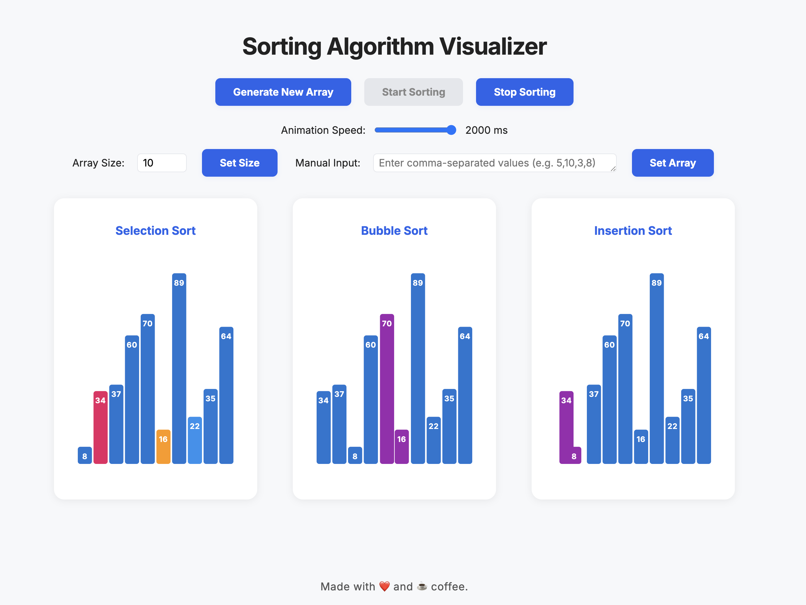

# Sorting Algorithm Visualizer

A visual representation of different sorting algorithms using D3.js. This project helps understand how various sorting algorithms work by providing real-time visualization of the sorting process.

**🔗 [Live Demo](https://afshin-zanganeh.github.io/d3-sort-visualizer/)**



## Features

- Visualize three different sorting algorithms:
  - Selection Sort
  - Bubble Sort
  - Insertion Sort
- Real-time animation of sorting process
- Adjustable animation speed
- Customizable array size (2-50 elements)
- Manual array input option
- Random array generation
- Side-by-side comparison of different algorithms
- Color-coded visualization:
  - Blue: Default state
  - Light Blue: Elements being compared
  - Orange: Current minimum element
  - Pink: Current element
  - Purple: Elements being swapped

## Technologies Used

- HTML5
- CSS3
- JavaScript (ES6+)
- D3.js for visualization

## Getting Started

### Prerequisites

- A modern web browser (Chrome, Firefox, Safari, or Edge)
- Node.js and npm (for development)

### Installation

1. Clone the repository:

   ```bash
   git clone https://github.com/Afshin-Zanganeh/d3-sort-visualizer.git
   cd d3-sort-visualizer
   ```

2. Install dependencies:

   ```bash
   pnpm install
   ```

3. Start the development server:
   ```bash
   pnpm dev
   ```

## Usage

1. **Generate Random Array**

   - Click the "Generate New Array" button to create a new random array
   - The array size can be adjusted using the input field (2-50 elements)

2. **Manual Array Input**

   - Enter comma-separated numbers in the input field
   - Click "Set Array" to visualize the custom array
   - Values must be between 5 and 100

3. **Control Sorting**

   - Click "Sort All" to start all sorting algorithms simultaneously
   - Click "Stop" to halt the sorting process
   - Adjust the speed slider to control animation speed

4. **Understanding the Visualization**
   - Each algorithm is displayed in its own section
   - Colors indicate the current state of elements
   - Numbers on bars show the actual values being sorted

## Contributing

Contributions are welcome! Please feel free to submit a Pull Request.

## License

This project is licensed under the MIT License - see the [LICENSE](LICENSE) file for details.

## Acknowledgments

- D3.js for the visualization library
- Original repository: [d3-sort-visualizer](https://github.com/Afshin-Zanganeh/d3-sort-visualizer)
